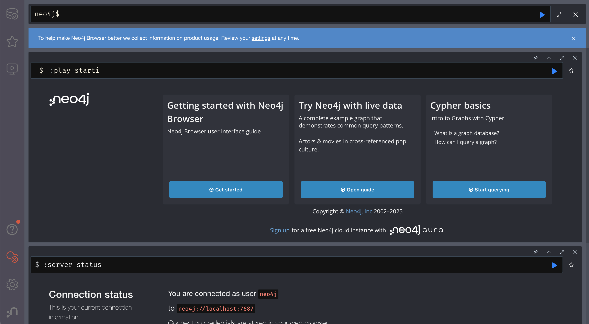

# Step 1. Neo4j を起動する

1. リポジトリ直下で Docker Compose を実行。
   ```bash
   docker compose -f docker/compose.yml up -d
   ```
2. 初回は Neo4j イメージを pull するため数分かかります。完了したら `docker compose -f docker/compose.yml ps` で `neo4j-local` が `Up (healthy)` か確認。
3. ブラウザから http://localhost:7474 にアクセスし、ログインフォームを次のように入力して `Connect` を押下。
   - **Connect URL**: `bolt://localhost:7687`（単一インスタンスなので bolt:// を選択）
   - **Database**: 空欄（デフォルト DB）
   - **Authentication type**: `Username / Password`
   - **Username**: `neo4j`
   - **Password**: `localtest`
   ダッシュボードが開けば起動完了です。
4. ログイン後の画面例（`docs/hans_on/images/dashbord_top.png`）は以下の通りです。上部の `neo4j$` プロンプトがクエリ入力欄、中央のカードがチュートリアルガイド、下部の `:server status` 結果で接続情報を確認できます。

   

5. `neo4j$` と表示されている入力欄がクエリ実行場所です。ここに `:schema` や `MATCH (n) RETURN n LIMIT 25;` を入力し、右側の ▶︎ ボタン（または `Cmd/Ctrl+Enter`）で実行します。以下は `MATCH (n) RETURN n LIMIT 25;` を実行し、グラフビューでノード/リレーションを確認した例です。

   _RETURN_n_LIMIT_25.png)

   結果パネルで `Table`/`Graph` を切り替え、リレーション線をクリックすると `weight` や `kind` などの詳細が表示されます。`Table` ビューでは各ノードが JSON 形式で表示され、`labels` がノードラベル、`properties` が `title_id` や `average_rating` など保持している値、`elementId` が Neo4j 内部 ID を表します。下図のように左側の `Table` タブを選ぶと詳細が確認できます。

   _RETURN_n_LIMIT_25_table.png)
6. ログを追いたい場合は `docker compose -f docker/compose.yml logs -f neo4j` で監視。
