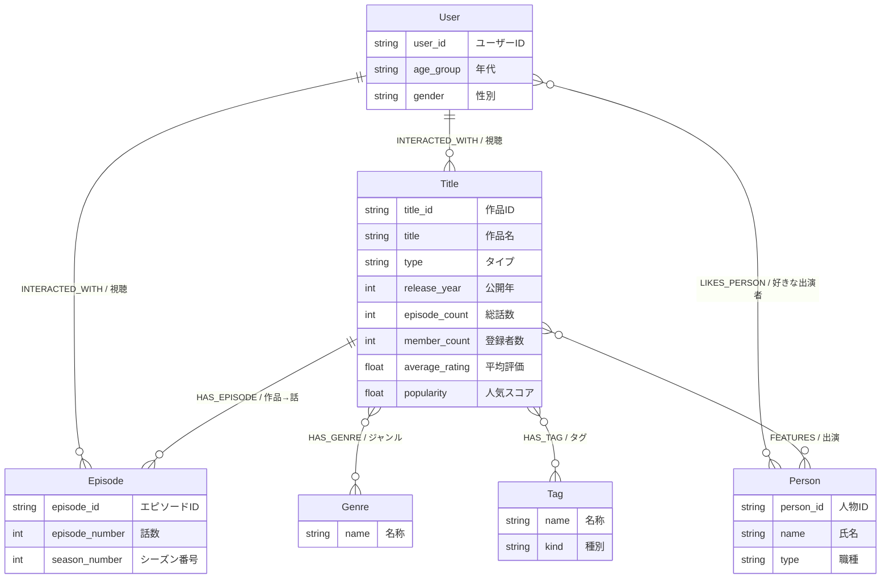
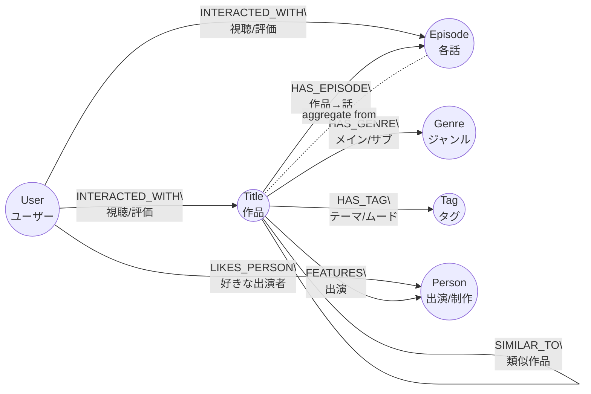

# レコメンド要件とデータモデル定義

結論から：レコメンド用の**要件**と、AI（＋Neo4j）が扱いやすいように整えた**データモデル定義**を、ジャンルのメイン/サブや出演者の重み付けも含めてまとめる。

---

## 1. レコメンド全体の要件まとめ

### 1-1. レコメンド観点

1. **ユーザー視聴傾向ベース**
   * 視聴履歴・評価・お気に入りから「好みのジャンル/タレント/タグ」を抽出
2. **タレント（出演者）ベース**
   * よく見ている出演者／好きな出演者から、他の出演作品を推薦
3. **コンテンツ（番組の傾向）ベース**
   * ジャンル・タグ・出演者構成の似た作品を推薦
4. **属性ベース（年齢・性別）**
   * 年代・性別が近いユーザーの行動からレコメンド
   * コールドスタート対策としても利用

### 1-2. データ構造の方針

* **行動グラフ**：`User -[INTERACTED_WITH]-> Title/Episode`
* **属性グラフ**：`Title -[HAS_GENRE/HAS_TAG/FEATURES]-> Genre/Tag/Person`
* **重み付きリレーション**で「メイン/サブ」「主演/脇役」を表現
* Kaggle アニメデータからは「総話数 (`episode_count`)」「サイト登録者数 (`member_count`)」「作品平均評価 (`average_rating`)」を Title プロパティへ反映
* よく使う類似度は `SIMILAR_TO` エッジとして**前計算**してもよい

---

## 2. ノード定義（AI 向け・機械的）

### 2-1. User

* **Label**: `User`
* **必須プロパティ**
  * `user_id: string`  （ユニーク）
* **推奨プロパティ**
  * `age_group: string` 例: `"10s"`, `"20s"`, `"30s"`, `"40s"`, `"50s"`, `"60plus"`
  * `gender: string` 例: `"male"`, `"female"`, `"other"`, `"unknown"`
  * `created_at: datetime`（任意）

### 2-2. Title（シリーズ／映画など作品単位）

* **Label**: `Title`
* **必須プロパティ**
  * `title_id: string`（ユニーク）
  * `title: string`
  * `type: string` 例: `"movie"`, `"drama"`, `"anime"`
* **推奨プロパティ**
  * `release_year: int`
  * `episode_count: int` Kaggle `episodes` 列を格納（全話数のみ、シーズン情報は別ソース必要）
  * `member_count: int` Kaggle `members` 列（人気指標）
  * `average_rating: float` Kaggle `rating` 列（`rating_source: "kaggle_anime"` などで出典を保持）
  * `popularity: float`（再生数や人気スコア。`member_count` を正規化して流用可）
  * `summary: string`（任意）

### 2-3. Episode（各話）

Kaggle CSV からはエピソード個別情報やシーズン番号を取得できないため、必要に応じて別ソースから生成・連携する。

* **Label**: `Episode`
* **必須プロパティ**
  * `episode_id: string`（ユニーク）
  * `episode_number: int`
* **推奨プロパティ**
  * `season_number: int`
  * `title_local: string`（サブタイトル）
  * `duration_minutes: float`

### 2-4. Genre

* **Label**: `Genre`
* **必須プロパティ**
  * `name: string`（ユニーク）例: `"Action"`, `"Romance"`

※ **メイン/サブの情報はノード側ではなくリレーション側**に持たせる。

### 2-5. Tag（テーマ・雰囲気など）

* **Label**: `Tag`
* **必須プロパティ**
  * `name: string`（ユニーク）
* **推奨プロパティ**
  * `kind: string` 例: `"theme"`, `"mood"`, `"setting"`

### 2-6. Person（俳優・声優・監督など）

* **Label**: `Person`
* **必須プロパティ**
  * `person_id: string`（ユニーク）
  * `name: string`
* **推奨プロパティ**
  * `type: string` 例: `"actor"`, `"voice_actor"`, `"director"`, `"writer"`

---

## 3. リレーション定義（ジャンルのメイン/サブ含む）

### 3-1. Title と Episode の階層

* **Pattern**: `(:Title)-[:HAS_EPISODE]->(:Episode)`
* **プロパティ**: 基本はなし（必要であれば `order:int` など）

### 3-2. ユーザー行動：INTERACTED_WITH

視聴・お気に入り・評価などを**1本のエッジにまとめて**表現。

* **Pattern**: `(:User)-[i:INTERACTED_WITH]->(:Episode)` または `(:User)-[i:INTERACTED_WITH]->(:Title)`
* **プロパティ**

| 名称                | 型        | 説明                                                              |
| ----------------- | -------- | --------------------------------------------------------------- |
| `kind`            | string   | `"play"`, `"completed"`, `"favorite"`, `"like"`, `"dislike"` など |
| `rating`          | float    | ユーザー評価（1〜5など）。Kaggle `rating=-1` は `status="planned"` などで区別 |
| `watch_count`     | int      | 視聴回数                                                            |
| `progress`        | float    | 視聴完了率 0.0〜1.0                                                   |
| `last_watched_at` | datetime | 最終視聴日時                                                          |
| `weight`          | float    | レコメンド用に統合した重み                                                   |
| `source`          | string   | データソース（例: `"kaggle_anime_ratings"`）                                |
| `status`          | string   | `"planned"`, `"in_progress"`, `"completed"` など任意の視聴状態                        |

### 3-3. ジャンル紐付け：HAS_GENRE（メイン・サブ）

* **Pattern**: `(:Title)-[g:HAS_GENRE]->(:Genre)`
* **プロパティ**

| 名称       | 型      | 説明                             |
| -------- | ------ | ------------------------------ |
| `kind`   | string | `"main"` or `"sub"` など         |
| `weight` | float  | 類似度計算用の重み。例: main=1.0, sub=0.5 |
| `source` | string | メタデータの由来（任意）                   |

### 3-4. タグ紐付け：HAS_TAG

* **Pattern**: `(:Title)-[t:HAS_TAG]->(:Tag)`
* **プロパティ**

| 名称         | 型     | 説明             |
| ---------- | ----- | -------------- |
| `strength` | float | タグの強さ（0.0〜1.0） |
| `weight`   | float | 類似度計算に直接使う値    |

### 3-5. 出演者紐付け：FEATURES（主演/その他）

* **Pattern**: `(:Title)-[c:FEATURES]->(:Person)`
* **プロパティ**

| 名称              | 型      | 説明                                              |
| --------------- | ------ | ----------------------------------------------- |
| `credit_role`   | string | `"actor"`, `"voice_actor"`, `"director"` など     |
| `position`      | string | `"lead"`, `"supporting"`, `"cameo"` など          |
| `billing_order` | int    | クレジット順（0 が一番上）                                  |
| `weight`        | float  | 類似度計算用重み。例: lead=1.0, supporting=0.7, cameo=0.3 |

### 3-6. 好きなタレント：LIKES_PERSON（任意）

* **Pattern**: `(:User)-[l:LIKES_PERSON]->(:Person)`
* **プロパティ**: `created_at: datetime`

### 3-7. 類似コンテンツ：SIMILAR_TO（バッチ前計算）

* **Pattern**: `(:Title)-[s:SIMILAR_TO]->(:Title)`
* **プロパティ**

| 名称           | 型        | 説明                               |
| ------------ | -------- | -------------------------------- |
| `score`      | float    | 類似度スコア（0〜1 など）                   |
| `by`         | string   | 類似度の算出方法（例: `"genre_cast_user"`） |
| `updated_at` | datetime | スコア更新日時                          |

---

## 4. 図表（Mermaid ER 風）



> 注記: `SIMILAR_TO (Title→Title)` のような自己参照リレーションは `erDiagram` ではレイアウトが崩れやすいため、上記図からは省略し、次の Flowchart 図で補足しています。

### 4-1. 関係を強調したグラフ図（Flowchart）



---

## 5. JSON 風スキーマ（AI 学習向け）

### 5-1. Nodes

```json
{
  "nodes": [
    {
      "label": "User",
      "properties": {
        "user_id": "string[unique]",
        "age_group": "string[optional]",
        "gender": "string[optional]"
      }
    },
    {
      "label": "Title",
      "properties": {
        "title_id": "string[unique]",
        "title": "string",
        "type": "string",
        "release_year": "int[optional]",
        "episode_count": "int[optional]",
        "member_count": "int[optional]",
        "average_rating": "float[optional]",
        "rating_source": "string[optional]",
        "popularity": "float[optional]"
      }
    },
    {
      "label": "Episode",
      "properties": {
        "episode_id": "string[unique]",
        "episode_number": "int",
        "season_number": "int[optional]",
        "title_local": "string[optional]",
        "duration_minutes": "float[optional]"
      }
    },
    {
      "label": "Genre",
      "properties": {
        "name": "string[unique]"
      }
    },
    {
      "label": "Tag",
      "properties": {
        "name": "string[unique]",
        "kind": "string[optional]"
      }
    },
    {
      "label": "Person",
      "properties": {
        "person_id": "string[unique]",
        "name": "string",
        "type": "string"
      }
    }
  ]
}
```

### 5-2. Relationships

```json
{
  "relationships": [
    {
      "type": "INTERACTED_WITH",
      "from": "User",
      "to": "Title|Episode",
      "properties": {
        "kind": "string",
        "rating": "float[optional]",
        "watch_count": "int[optional]",
        "progress": "float[optional]",
        "last_watched_at": "datetime[optional]",
        "weight": "float[optional]",
        "source": "string[optional]",
        "status": "string[optional]"
      }
    },
    {
      "type": "HAS_EPISODE",
      "from": "Title",
      "to": "Episode",
      "properties": {}
    },
    {
      "type": "HAS_GENRE",
      "from": "Title",
      "to": "Genre",
      "properties": {
        "kind": "string",
        "weight": "float",
        "source": "string[optional]"
      }
    },
    {
      "type": "HAS_TAG",
      "from": "Title",
      "to": "Tag",
      "properties": {
        "strength": "float[optional]",
        "weight": "float[optional]"
      }
    },
    {
      "type": "FEATURES",
      "from": "Title",
      "to": "Person",
      "properties": {
        "credit_role": "string",
        "position": "string",
        "billing_order": "int[optional]",
        "weight": "float[optional]"
      }
    },
    {
      "type": "LIKES_PERSON",
      "from": "User",
      "to": "Person",
      "properties": {
        "created_at": "datetime[optional]"
      }
    },
    {
      "type": "SIMILAR_TO",
      "from": "Title",
      "to": "Title",
      "properties": {
        "score": "float",
        "by": "string",
        "updated_at": "datetime[optional]"
      }
    }
  ]
}
```

---

このスキーマに基づき、Neo4j 用 `CREATE CONSTRAINT` や `LOAD CSV`、AI 学習データ作成を進める。
